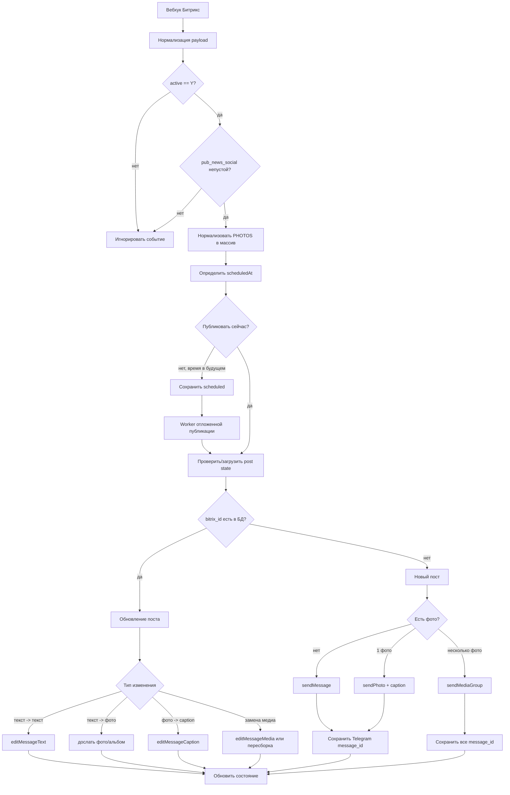
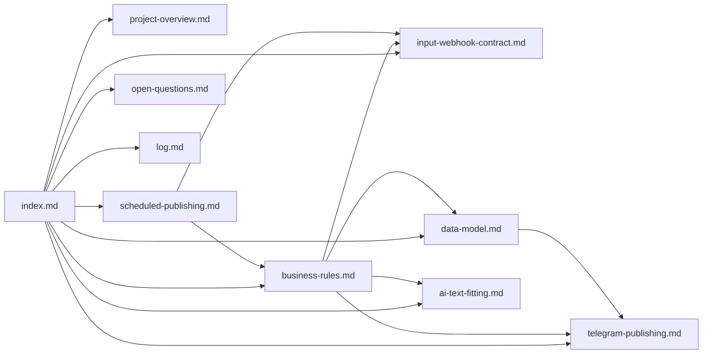

# Граф проекта

Этот граф показывает, как страницы wiki, сущности и сценарии связаны между собой.

```mermaid
flowchart TD
    A["Вебхук Битрикс"] --> B["Нормализация payload"]
    B --> C{"active == Y?"}
    C -- "нет" --> I["Игнорировать событие"]
    C -- "да" --> D{"pub_news_social непустой?"}
    D -- "нет" --> I
    D -- "да" --> E["Нормализовать PHOTOS в массив"]
    E --> F["Определить scheduledAt"]
    F --> G{"Публиковать сейчас?"}
    G -- "нет, время в будущем" --> H["Сохранить scheduled"]
    H --> W["Worker отложенной публикации"]
    W --> J["Проверить/загрузить post state"]
    G -- "да" --> J
    J --> K{"bitrix_id есть в БД?"}
    K -- "нет" --> L["Новый пост"]
    K -- "да" --> M["Обновление поста"]
    L --> N{"Есть фото?"}
    N -- "нет" --> O["sendMessage"]
    N -- "1 фото" --> P["sendPhoto + caption"]
    N -- "несколько фото" --> Q["sendMediaGroup"]
    M --> R{"Тип изменения"}
    R -- "текст -> текст" --> S["editMessageText"]
    R -- "текст -> фото" --> T["дослать фото/альбом"]
    R -- "фото -> caption" --> U["editMessageCaption"]
    R -- "замена медиа" --> V["editMessageMedia или пересборка"]
    O --> X["Сохранить Telegram message_id"]
    P --> X
    Q --> Y["Сохранить все message_id"]
    S --> Z["Обновить состояние"]
    T --> Z
    U --> Z
    V --> Z
    X --> Z
    Y --> Z
```

## Граф страниц

```mermaid
graph LR
    index["index.md"] --> overview["project-overview.md"]
    index --> contract["input-webhook-contract.md"]
    index --> rules["business-rules.md"]
    index --> db["data-model.md"]
    index --> tg["telegram-publishing.md"]
    index --> ai["ai-text-fitting.md"]
    index --> schedule["scheduled-publishing.md"]
    index --> questions["open-questions.md"]
    index --> log["log.md"]
    rules --> contract
    rules --> db
    rules --> tg
    rules --> ai
    schedule --> contract
    schedule --> rules
    db --> tg
```

